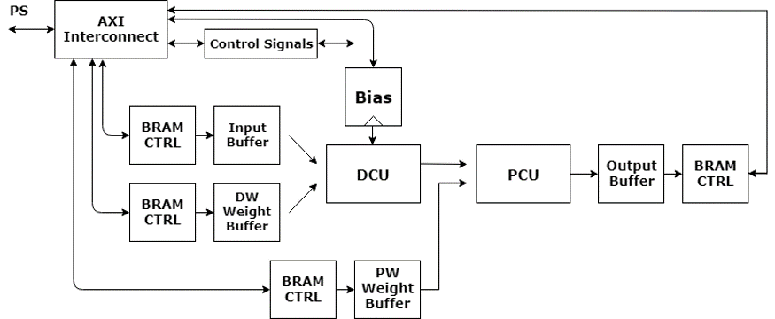
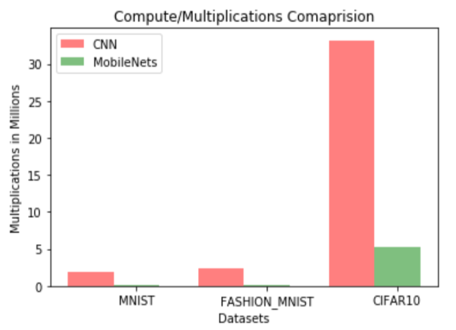
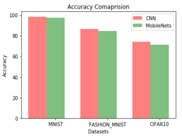

# Hardware Accelerator for Mobilenets Neural Network Model

## About
Design of hardware accelerator for MobileNets Neural Network using Vivado HLx suite. The architecture of this design is as shown in the block diagram below. The Block RAM's stores the image data as well as the weight buffers and results of the computation are stored in an Output buffer BRAM. The accelerator was designed using Verilog and tested using C and System Verilog testbenches. The design includes the 'Fused Multiply-Add Floating Point IP' of Xilinx Vivado. This design was implemented on a MiniZed FPGA Board.

## Hardware Architecture Block Diagram

## MobileNets Neural Network

### What are MobileNets?
Improvised CNN architectures for Embedded Applications which consists of two layers, Depthwise Separable layer and Pointwise Convolution layer.

### Why MobileNets?
Relatively larger magnitude of reduction in number of computations, consume less power, energy efficient and low latency. These advantages are obtained at the cost of accuracy.

### Accuracy vs Computations Tradeoffs
These graphs show the comparisons between standard CNNs and MobileNets model in terms of computations and accuracy, for the MNIST, Fashion_MNIST and CIFAR 10 datasets. The neural networks consisted of 5-layers (4 convolution and 1 FCN layer), with the MobileNets model implementing Depthwise Seperable Convolution.

  
